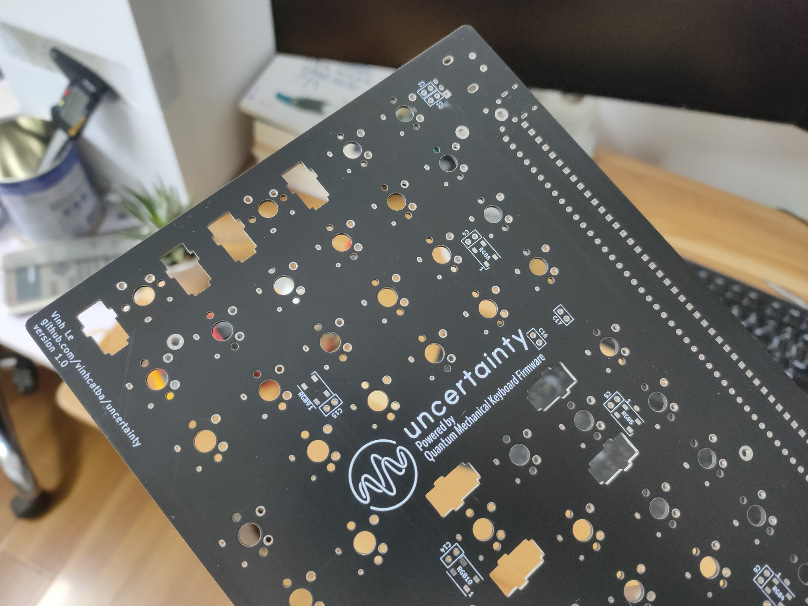
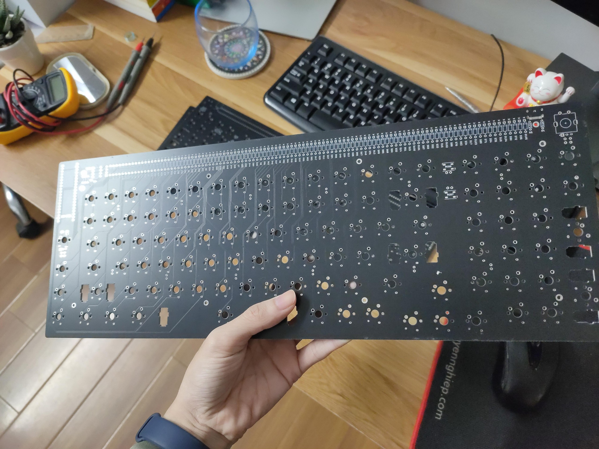
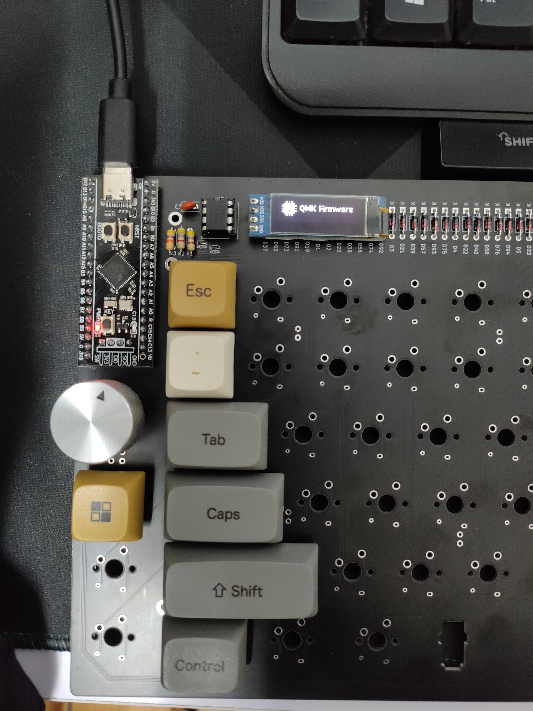
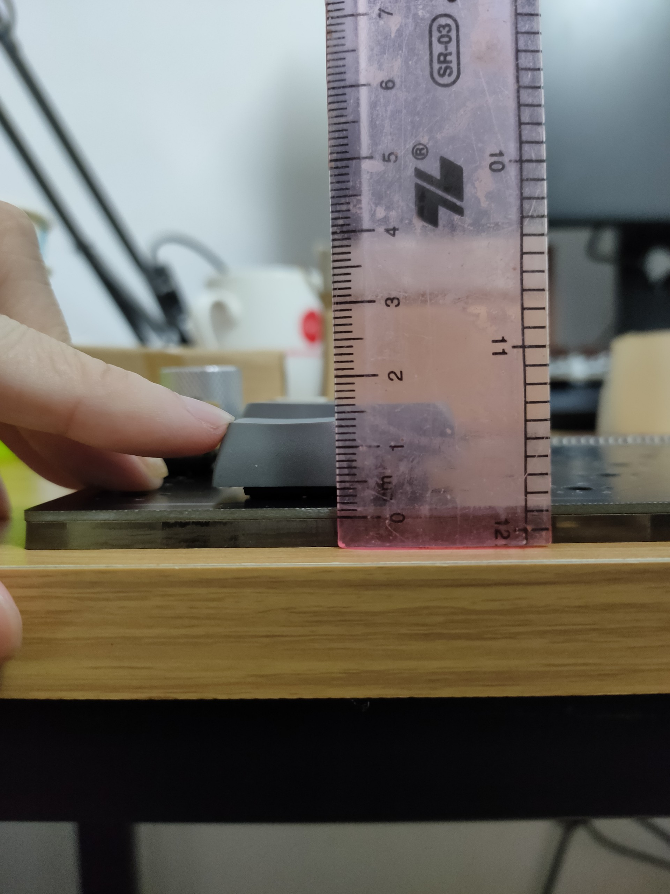
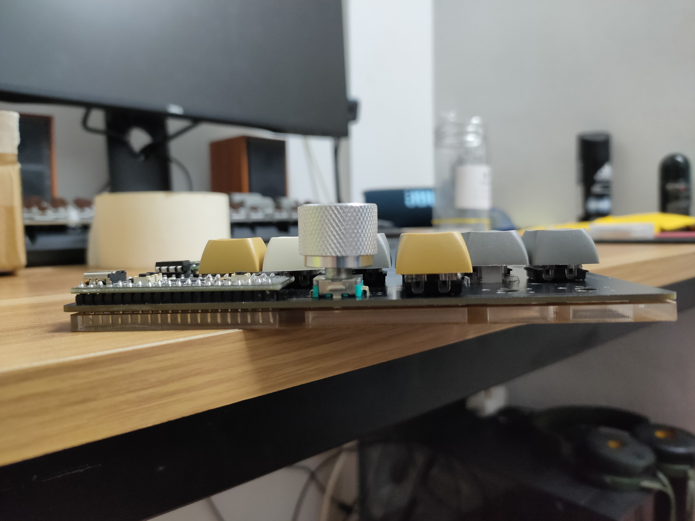

# uncertainty
a low profile mechanical keyboard that can use any keycap

# Features:
- MX switches compatible (south facing, must be used with a plate)
- Low profile switch: Gateron KS-27/KS-33 or NuPhy's low profile switches
- All through-hole component (except for WS2812B RGBs)
- Layout 1800 with 3 additional keys
- Universal plate mounted stab compatible
- Universal MX-style keycap compatible (tested on OEM, XDA)
- ~20mm tall (without feet), can go down to ~18mm with slim keycaps 
- Rotary encoder, 128x32 OLED, Underglow RGB, USB type-C left and right
- QMK/VIA support of course!
- KS-27 hot-swap without mill-max or hotswap socket

PCB design, acrylic case, build guides will be update soon after I finished testing, reviewing, fixing.
Here are some first sight photos:

